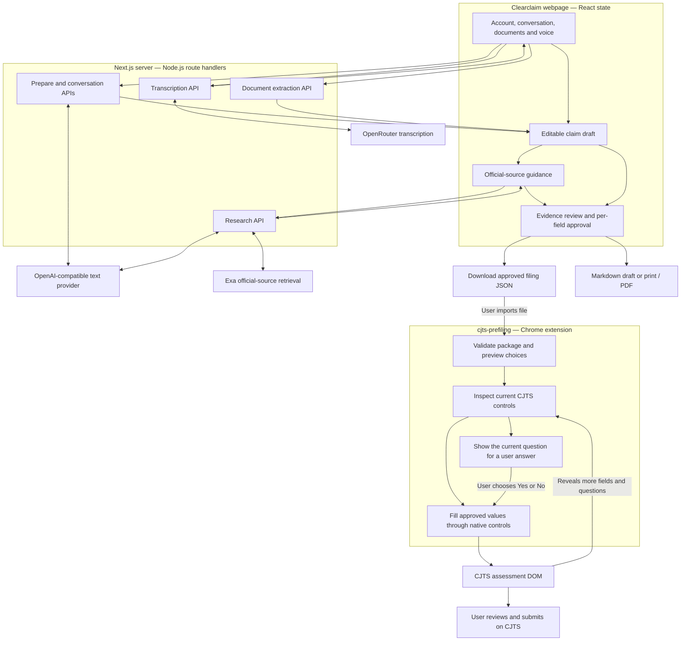
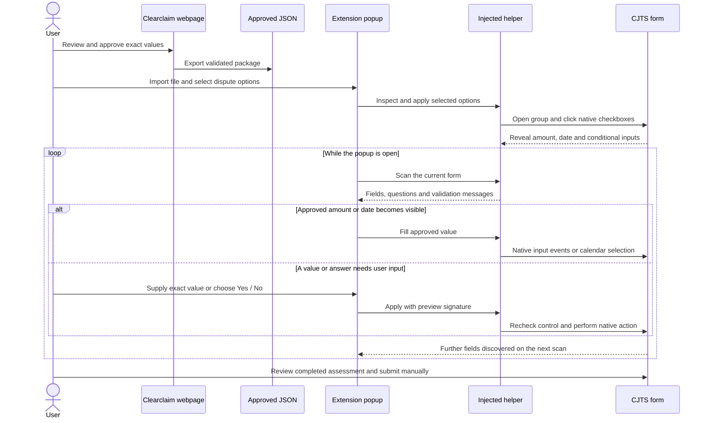

# Clearclaim

Clearclaim turns a person’s account of a dispute into a reviewed Singapore Small Claims Tribunals preparation draft, then transfers approved values into CJTS through a Chrome extension. The webpage handles intake, evidence, optional AI organisation, source research, and field approval. The extension handles the destination form: it reads visible controls, fills reviewed values, and follows the questions revealed by the SCT assessment.

The repository contains a Next.js application and one standalone Manifest V3 extension in [`cjts-prefiling/`](cjts-prefiling/). They share a JSON contract and communicate through a file the user exports and imports. Court submission remains a separate action on CJTS.

## Architecture



The browser and server have separate responsibilities. React owns the working case and its review state. Route handlers perform bounded document or provider work and return structured results. The extension does not call the app’s APIs or an AI provider: it receives approved data through JSON and interacts with the active CJTS tab using `chrome.scripting.executeScript`.

## Getting started

Use Node.js 22 or newer and npm. Install the application dependencies and create the local server configuration:

```sh
npm ci
cp .env.example .env
npm run dev
```

Open [localhost:3000](http://localhost:3000). Basic organisation uses local extraction, and reference guidance is bundled with the application. External services are enabled through the server configuration and the corresponding user consent controls.

For the extension:

1. Open `chrome://extensions` and enable Developer mode.
2. Choose **Load unpacked** and select `cjts-prefiling/`.
3. In the webpage, review the claim in **Prepare to file**, approve individual fields, and choose **Export approved filing JSON**.
4. Open the SCT assessment, open the extension, and import the JSON.
5. Scan, select the dispute options, and apply them. Keep the popup open to fill remaining values and answer newly revealed questions.

The extension has no separate build step. Reload it in Chrome after changing its files. Detailed control mappings and popup usage are documented in [the extension guide](cjts-prefiling/README.md).

### Configuration

All provider credentials are read by server code. Configuration values and defaults are defined in [`.env.example`](.env.example).

| Variable | Purpose |
| --- | --- |
| `OPENAI_API_KEY` | Credential for text organisation, conversation interpretation, and research drafting. |
| `OPENAI_BASE_URL` | OpenAI-compatible endpoint; defaults to `https://openrouter.ai/api/v1`. |
| `OPENAI_TEXT_MODEL` | Text model identifier; defaults to `dots-studio/dots-3-note-preview:free`. |
| `EXA_API_KEY` | Credential for official-source retrieval. |
| `OPENROUTER_API_KEY` | Credential for audio transcription. |
| `OPENROUTER_TRANSCRIPTION_MODEL` | Audio model identifier; defaults to `openai/whisper-large-v3`. |

AI organisation and research use the workspace’s AI consent. Voice transcription has a separate audio consent control and browser microphone permission. Restart the development server after changing `.env`.

## Webpage and domain model

[`src/app/page.tsx`](src/app/page.tsx) is the server entry point. It supplies a research-availability flag to [`ClaimWorkspace`](src/components/claim-workspace.tsx), the main client component. The workspace owns navigation, original accounts, evidence, the editable draft, research sections, assertion links, and approvals.

The four workspace steps are:

| Step | Data and behavior |
| --- | --- |
| Tell your story | Long-form account, short conversational messages, voice transcript review, document import, and evidence attachment. |
| Organise your claim | Editable parties, category, amount, date, chronology, requested outcome, and the other party’s position. |
| Review the guidance | Reference or retrieved guidance covering parties, eligibility, facts and evidence, outcomes, and filing/service. |
| Prepare to file | Assertion checks, evidence links, per-field approval, preparation-draft download, JSON export, and the CJTS portal link. |

### Core types

[`src/lib/claim.ts`](src/lib/claim.ts) defines the Zod schemas and claim-domain helpers. [`src/lib/review.ts`](src/lib/review.ts) defines provenance, approvals, and the review model.

| Type | Responsibility |
| --- | --- |
| `Draft` | Claim particulars and workspace choices, including claimant type, respondent location, and higher-limit consent. |
| `Evidence` | File metadata, extracted text, extraction status, and the user’s description of what the record shows. |
| `Statement` | An original typed or voice-derived message with language, input method, and timestamp. |
| `Observation` | An interpretation tied to the conversation’s source text. |
| `Assertion` | A statement linked to supporting or contradictory evidence, with an explicit assumption flag. |
| `FieldReview` | One exact value, its provenance, and its review state. |
| `Research` | Section results, citations, retrieval time, and reference/live/partial mode. |

[`workspace-draft.ts`](src/lib/workspace-draft.ts) merges organisation proposals while preserving explicit user edits and local workspace choices. The workspace invalidates relevant approvals when the underlying account, evidence, or reviewed values change. `approvedPackage()` independently checks that an approved value still matches the current draft before including it in an export.

### Documents and speech

[`workspace-upload.ts`](src/lib/workspace-upload.ts) validates file selection and coordinates extraction. TXT is read in the browser; PDF and DOCX are sent to `/api/extract`. The server uses `pdf-parse` and `mammoth` respectively. Image evidence is represented by its file record and a user-supplied description.

Evidence limits are 10 files, 10 MB per file, and 25 MB combined. Extracted text is bounded at 30,000 characters. The original files remain separate from the exported preparation draft and transfer JSON.

[`conversation-intake.tsx`](src/components/conversation-intake.tsx) uses [`speech.ts`](src/lib/speech.ts) for recording, language hints, cancellation, and transcription. The recording lifecycle releases microphone tracks before awaiting a transcript. The returned text stays editable before it is added to the account. A recording is limited to 60 seconds and 10 MB.

## Server APIs and provider integration

The API routes are `POST` handlers using the Node.js runtime. [`http.ts`](src/lib/http.ts) supplies request-body limits, origin checks, consistent error responses, and an in-process capacity guard for provider work. [`api-client.ts`](src/lib/api-client.ts) handles browser JSON requests and combines caller cancellation with a request timeout.

| Route | Input | Output and orchestration |
| --- | --- | --- |
| [`/api/prepare`](src/app/api/prepare/route.ts) | Account, outcome, evidence, and AI consent | A `Draft` from the text provider or local labelled-field extraction. |
| [`/api/conversation`](src/app/api/conversation/route.ts) | Accumulated conversation, outcome, evidence, and consent | Draft, observations, follow-up prompt, and organisation mode. |
| [`/api/research`](src/app/api/research/route.ts) | Validated draft, evidence, and research consent | Five research sections, with independent section results and citations. |
| [`/api/extract`](src/app/api/extract/route.ts) | Multipart PDF or DOCX | Extracted text and document-processing result. |
| [`/api/transcribe`](src/app/api/transcribe/route.ts) | Audio recording and optional language hint | Transcript text from OpenRouter. |

### Organisation

[`openai.ts`](src/lib/openai.ts) encapsulates the OpenAI-compatible client, structured-output requests, normalisation, and provider deadlines. Claim categories are supplied in both the prompt and JSON schema. Amounts, categories, and dates are normalised before domain validation; unknown facts remain available for user correction.

The workspace aborts superseded requests and ignores responses with an old request token. Server organisation and research calls receive the request’s abort signal. Text-provider attempts share an end-to-end deadline, including the bounded retry path.

### Research

[`sources.ts`](src/lib/sources.ts) contains the official-source registry, research topics, URL checks, generic query construction, and reference guidance. [`exa.ts`](src/lib/exa.ts) runs the five topic searches concurrently under a shared deadline, then asks the text provider to draft section fields from the retrieved material.

A generated citation must match an allowed official URL returned by that section’s search. The result keeps citations per guidance field as well as per section. A failed section is represented explicitly without discarding the other section results. Reference guidance is selected by the workspace when live research is not used.

## Export contract

[`cjts-prefiling/transfer.mjs`](cjts-prefiling/transfer.mjs) is the single wire contract imported by both the webpage and the extension. It defines `filingFields`, field validation, the package size limit, and `parsePackage()`.

A minimal package looks like this:

```json
{
  "version": 1,
  "generatedAt": "2026-09-06T00:00:00.000Z",
  "userReviewed": true,
  "fields": {
    "amount": {
      "value": "1450",
      "review": "approved",
      "provenance": "user"
    }
  }
}
```

The permitted field keys are `claimant`, `respondent`, `amount`, `claimType`, `summary`, `outcome`, `incidentDate`, `timeline`, `caseNumber`, and `assessmentId`. Each exported value carries its own approval and provenance. The parser rejects unexpected fields, malformed metadata, invalid values, and packages larger than 2 MB.

The JSON contains only approved transfer fields and package metadata. It does not embed evidence files, research results, or the complete review trail. Those preparation materials belong to the Markdown export assembled by [`export.ts`](src/lib/export.ts) and the workspace. Print styles provide the separate PDF path through the browser’s print dialog.

## Extension architecture

The extension consists of native ES modules loaded by [`popup.html`](cjts-prefiling/popup.html). [`manifest.json`](cjts-prefiling/manifest.json) declares `activeTab` and `scripting`. The user’s toolbar interaction grants access to the active tab; injected functions run in Chrome’s isolated world and use native DOM events to invoke CJTS’s form behavior.

| Module | Responsibility |
| --- | --- |
| [`popup.mjs`](cjts-prefiling/popup.mjs) | Package import, dispute preview, selected-option application, and controller lifecycle. |
| [`claim-type.mjs`](cjts-prefiling/claim-type.mjs) | Four SCT dispute groups, 22 option labels, and category recommendations. |
| [`assessment-assist.mjs`](cjts-prefiling/assessment-assist.mjs) | Validate the destination, inspect dispute controls, open collapsed groups, and apply selected checkboxes. |
| [`progressive-popup.mjs`](cjts-prefiling/progressive-popup.mjs) | Poll the active assessment, render newly visible fields/questions, retain typed values, and coordinate fill/answer actions. |
| [`progressive-assist.mjs`](cjts-prefiling/progressive-assist.mjs) | Inspect and operate the amount, date picker, group-specific Others inputs, consent, and current Yes/No questions. |
| [`form-popup.mjs`](cjts-prefiling/form-popup.mjs) | General claim-form preview, deselection, and transfer controls. |
| [`form-assist.mjs`](cjts-prefiling/form-assist.mjs) | Match approved fields to unique semantic labels on a claim form and fill compatible empty controls. |
| [`run-action.mjs`](cjts-prefiling/run-action.mjs) | Explicit terms-page actions using an allowlist of destination controls. |
| [`actions.json`](cjts-prefiling/actions.json) | Recorded portal routes, control mappings, option groups, and source references. |

### Progressive filling

CJTS changes its form as the user supplies information. Dispute selection reveals initial fields; entering an amount may reveal a consent question; each questionnaire answer may reveal a different next question. The popup therefore scans repeatedly instead of treating its initial preview as the complete form.



The progressive controller polls once per second while connected to an assessment. Approved imported amount/date values are attempted when their controls appear. Missing values and Others descriptions are entered in the popup and applied explicitly. Questionnaire and consent answers always come from the user.

Before applying an action, the injected helper checks the destination route, current control, branch, and preview signature. Dates are selected by year, month, and exact accessible day label in CJTS’s calendar. Existing values are preserved; ambiguous or unrecognised controls and portal validation messages are surfaced in the popup.

Importing a replacement package resets previews and local answers. Closing the popup discards its in-memory package; the values already entered on CJTS remain on that page. Reimporting and scanning resumes from the current form.

## Repository map

```text
src/
  app/
    api/                 Node.js route handlers
    styles/              Global tokens, element defaults, shared UI
    page.tsx             Server entry point
    layout.tsx           Metadata and ordered stylesheet imports
  components/            Workspace, intake, review, research presentation
  lib/                   Domain schemas, review logic, providers, exports
cjts-prefiling/           Unpacked Chrome extension and shared JSON contract
public/                  Local CJTS, assessment and terms fixtures
scripts/                 Reproducible user-flow recording
tests/
  browser/               Playwright workspace and extension tests
  *.test.ts              Domain, route and provider-unit tests
  live-smoke.mts         Opt-in live text/research provider test
  live-cjts.mts          Opt-in public SCT assessment test
```

Styles are global and imported once by `layout.tsx`: tokens, base, shared UI, workspace layout, then feature styles. The extension has its own stylesheet because its popup runs in a separate document. Responsive and print rules live alongside the corresponding application styles.

## Development and testing

```sh
npm run typecheck
npm run lint
npm test
npx playwright install chromium
npm run test:e2e
```

Unit tests use Node’s test runner through `tsx`, importing helpers and route handlers directly. Provider clients are replaced with controlled responses. Browser tests exercise the workspace, downloads, microphone lifecycle, and the actual unpacked extension against local DOM fixtures.

[`extension-harness.ts`](tests/browser/extension-harness.ts) stages a copy of the extension with permission limited to the fixture host. This gives headless tests page access without a toolbar gesture and leaves the shipped manifest unchanged. The permission-boundary test uses the unmodified manifest.

Playwright runs with one worker and defines desktop and emulated mobile projects. It starts a development server on port 3100 unless `PLAYWRIGHT_BASE_URL` is set. To reuse an existing server, use the hostname on which it was started so Next.js accepts development-resource requests:

```sh
PLAYWRIGHT_BASE_URL=http://localhost:3000 npm run test:e2e
npm run test:e2e -- --project=desktop tests/browser/progressive.spec.ts
```

The extension suites cover import validation, exact-value export, permission checks, preview signatures, delayed field insertion, all four dispute groups, date selection, missing-value entry, questionnaire branches, and preservation of existing values. Fixtures deliberately model conditional DOM changes; they are separate from the live portal.

Live service tests are explicit commands:

```sh
npm run test:live -- 3 research
npm run test:cjts:live
```

The first exercises configured text/research providers using fictional accounts. The second traverses scripted public SCT assessment branches using fictional values and stops before submission. It does not use an authenticated claim-filing session.

## Record the user flow

[`scripts/record-user-flow.mts`](scripts/record-user-flow.mts) drives the real webpage and unpacked extension with Playwright, then encodes the captured browser views into an MP4 with FFmpeg. The recording follows a fictional corporate equipment dispute through evidence attachment, draft editing, reference guidance, individual approvals, JSON download/import, and the live public SCT assessment.

The assessment portion shows CJTS and the actual extension popup side by side. The script supplies explicit fictional-scenario answers to each question and stops at final review before submission. Its temporary extension copy grants access only to the public CJTS host so headless Chromium can exercise the normal scripting path.

Start the webpage, install Playwright Chromium and FFmpeg, then run:

```sh
PLAYWRIGHT_BASE_URL=http://localhost:3000 npm run record:userflow
```

Set `FFMPEG_PATH` if FFmpeg is outside `PATH`, and `RECORDING_DIR` to choose an output directory. By default, the script writes these artifacts under `artifacts/user-flow/`:

- `clearclaim-user-flow.mp4`: captioned recording of the webpage and live assessment.
- `chapters.json`: chapter timestamps, the scripted questions and answers, and completion metadata.
- `clearclaim-approved-filing.json`: the package downloaded from the webpage during the recording.
- `final-cjts.png` and `final-extension.png`: final review screenshots.

Generated recordings are excluded from Git. The recording uses local organisation and reference guidance, so it does not require text-generation or research credentials.

## Runtime and data ownership

The working case lives in the webpage’s React state and file references. The app has no case database, persistent browser case storage, or account/session layer. Refreshing the tab starts a new workspace; downloads are the mechanism for retaining preparation work.

Provider credentials remain on the server. Consented case context and extracted evidence go to the text provider; Exa receives generic official-source search queries; microphone audio goes through the transcription route. PDF/DOCX extraction runs in the server process. The extension keeps the imported package in popup memory and writes selected values to the active portal page.

The server applies body limits, origin checks, a process-local provider capacity limit, and `no-store` API responses. These controls belong to the application process; authentication, durable storage, and distributed request management are separate infrastructure concerns.

Production commands:

```sh
npm run build
npm start
```

For framework changes, read [`AGENTS.md`](AGENTS.md) and the relevant installed Next.js guide under `node_modules/next/dist/docs/` before editing application code.
